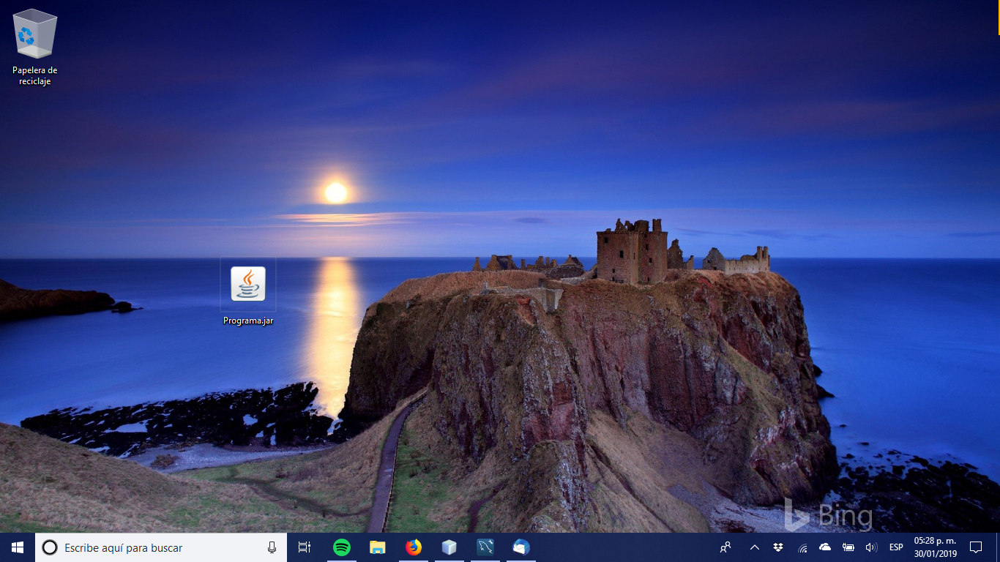
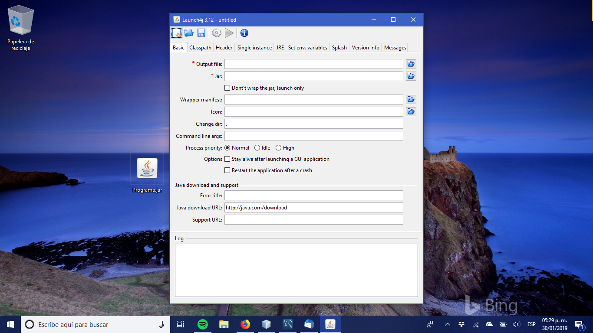
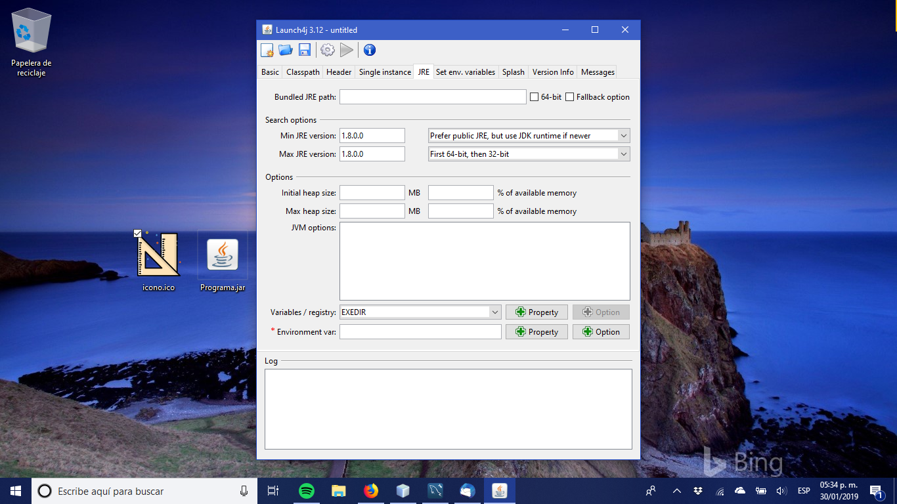
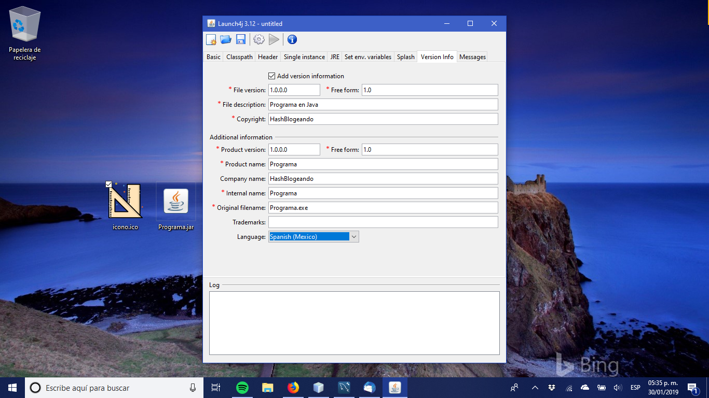
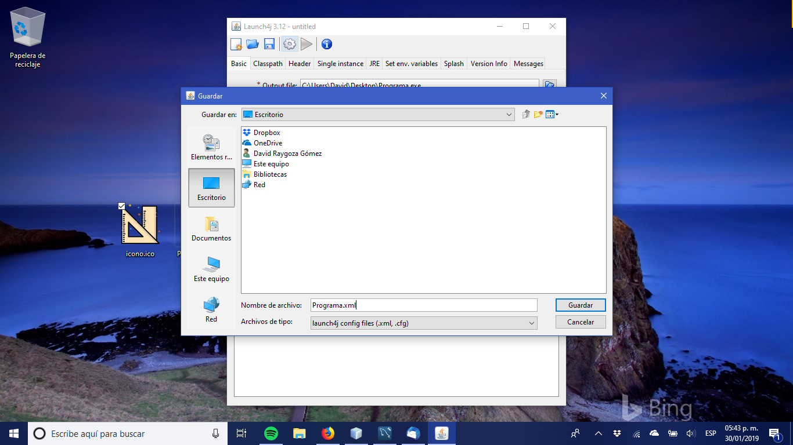
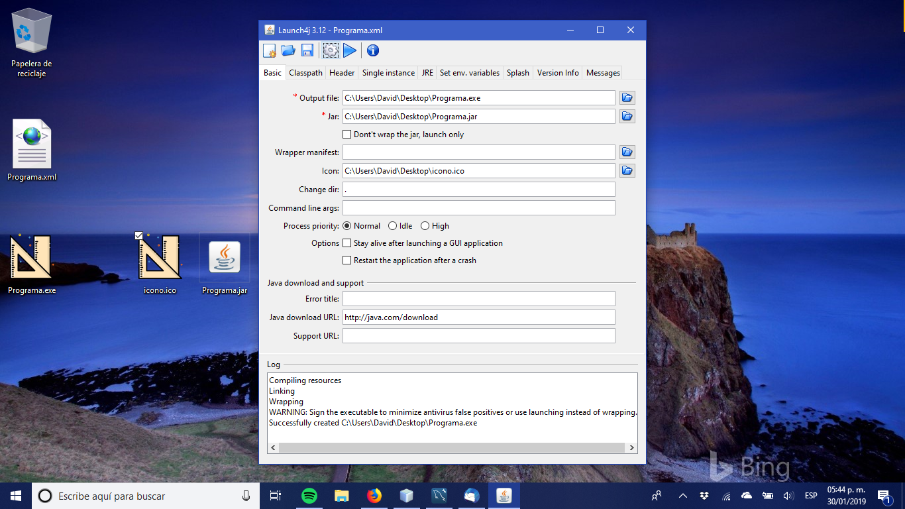
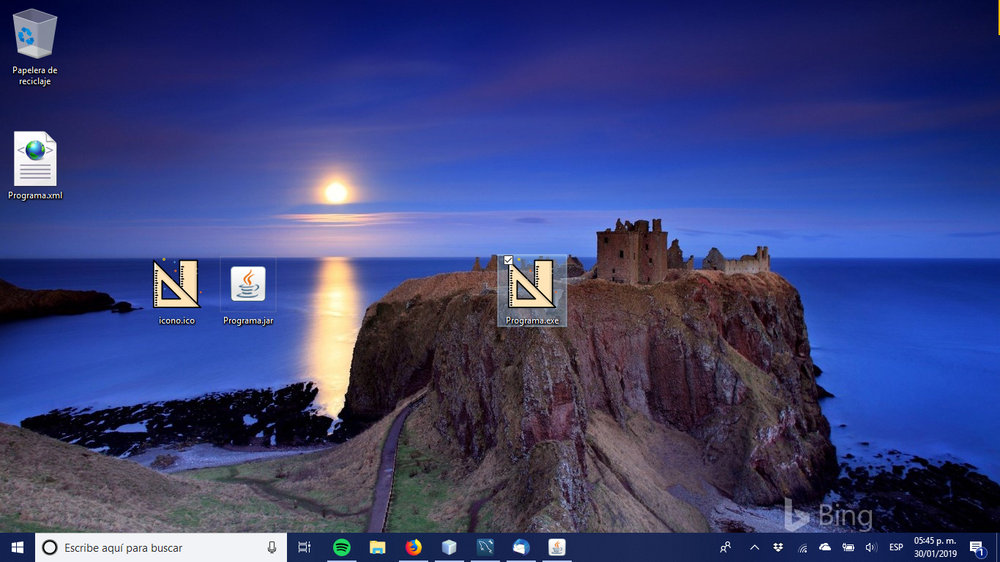
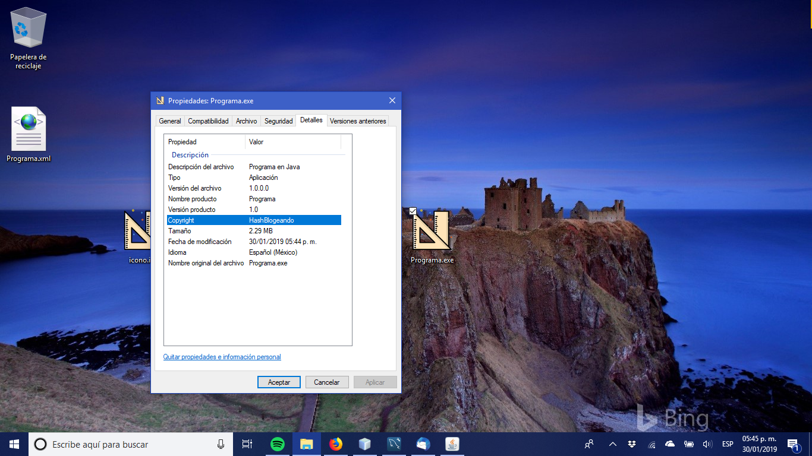

# Convertir un .jar en un ejecutable .exe

No me diga, termino su aplicación de escritorio en Java y al momento de poner el acceso directo en el escritorio, nota como que falta algo y aparte como que desentona de mala forma…

En efecto el icono default de los archivos .jar y la extensión .jar no son muy impresionantes, hacen que no parezca una aplicación sino algún archivo común y corriente, ¿Como corregimos eso?, creando un ejecutable .exe a partir de nuestro .jar.

## launch4j

Este venerable programa (data desde el 2004) hará el trabajo por nosotros ya que su función es precisamente esa, tomar un archivo .jar ejecutable y convertirlo en un archivo .exe, e incluso nos permite establecer un icono para dicho ejecutable.

¿Que necesitamos para usarlo?, Dos cosas un .jar ejecutable y el icono en formato .ico, este es el formato de iconos usado por Windows, si no tiene un archivo en ese formato no se preocupe, puede crear uno a partir de una imagen png con varias herramientas en linea [2].

Ya que tenga esos dos archivos abra el Launch4j, hay unos parámetros que debe configurar los cuales se detallaran a continuación.

## Estableciendo el JRE
Para poder generar su ejecutable debe especificar cual versión del Java Runtime Enviroment necesita, esto es básicamente la versión de Java en la que escribió su programa y es necesaria por motivos de compatibilidad, mas que nada para que al correr el programa se le avise si tiene una versión incompatible.

Para especificarla vaya a la pestaña JRE y llene los campos Min JRE version y Max JRE version

En cuanto a que versión poner le recomiendo ponga la versión de Java en la que escribió su programa como versión máxima y la versión inmediata anterior como versión mínima ,esto claro esta a menos que si requiera alguna versión en especifico, si ese es el caso este es un buen lugar para indicar eso.

## Información de versión

Una opción opcional pero altamente recomendable es incluir información sobre su programa, esto lo puede hacer desde la pestaña Version Info habilitando la opción Add version information.

Los datos a agregar se explican solos, solo recuerde que los campos indicados con un asterisco rojo son obligatorios y que tanto File version como Product version debe ponerse como cuatro números separados por puntos.

## Guardando la configuración
Ya que halla especificado la versión del JRE y los datos de su programa el ultimo paso consiste en ir a la pestaña Basic y seleccionar la ruta y nombre del ejecutable resultante, la ruta y nombre del .jar a convertir en ejecutable, el icono que usar y presionar el icono del engrane..

Lo que le pedirá que especifique donde guardar el archivo de configuración, esto es mas que nada por si quiere volver a genera el ejecutable después sin tener que ingresar toda la información de nuevo, así que le recomiendo lo guarde, hecho esto vera un mensaje como la siguiente figura.

## Generando el Ejecutable

El log le indicara si hay algún problema, probablemente vea la recomendación de firmar el ejecutable pero no causa problemas y si todo sale bien vera un archivo .exe con el icono indicado en la ubicación que especifico.

Y si abre las propiedades de ese archivo en la pestaña de detalles vera los datos que ingresamos previamente.

Por ultimo, ¿Recuerda la configuración que guardamos anteriormente?, ese se guardo en la ruta indicada, es un simple archivo xml.

## Referencias

[1] Launch4j — http://launch4j.sourceforge.net/index.html
[2] ConvertICO.com — https://convertico.com/
